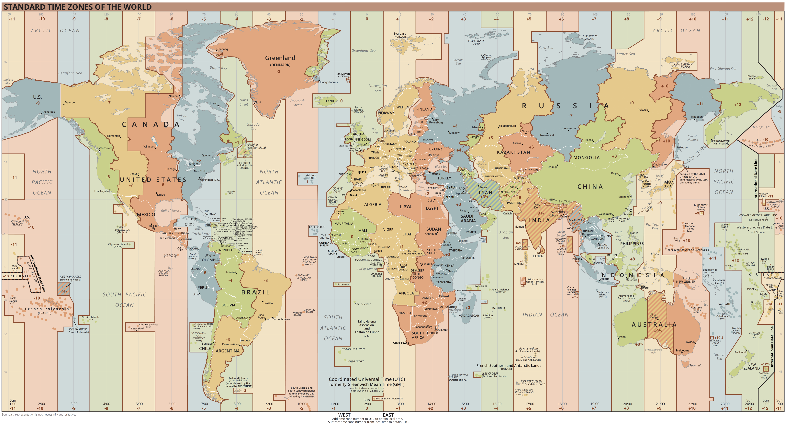

# Understanding Time Zones

Time zones can be confusing for many people. Not only is there a small amount of mathematics, but not every place follows the same rules. Let’s start with the basics.

## :material-clock-time-three: What is Coordinated Universal Time (UTC)?

_Coordinated Universal Time_ (or UTC) is the primary time standard by which the world regulates clocks and time. It is not adjusted for daylight savings time. It the successor to the older _Greenwich Mean Time_ (GMT).

* Every time zone on earth is either positive or negative time from UTC.
* UTC never has daylight savings.
* Daylight savings changes the offsets from UTC.
* The line goes from North → South through London, England, UK.
* The lines are almost _never_ straight all the way down/up.
* The opposite line on the other side of the world goes from North → South and is called the International Date Line. It runs though the Pacific Ocean.

<figure markdown>

{ loading=lazy }
<figcaption><small>By the U.S. Central Intelligence Agency, in the Public Domain</small></figcaption>

</figure>

??? question admonition "Why is it called UTC?"

    The official abbreviation for _Coordinated Universal Time_ is UTC.

    This abbreviation comes as a result of the _International Telecommunication Union_ and the _International Astronomical Union_ wanting to use the same abbreviation in all languages. English speakers originally proposed **CUT** (for “coordinated universal time”), while French speakers proposed **TUC** (for “temps universel coordonné”).

    The compromise that emerged was **UTC**.

??? note admonition "Basic history for the very curious"

    From [Wikipedia](https://en.wikipedia.org/wiki/Coordinated_Universal_Time):

    > The coordination of time and frequency transmissions around the world began on 1 January 1960. UTC was first officially adopted as CCIR Recommendation 374, Standard-Frequency and Time-Signal Emissions, in 1963, but the official abbreviation of UTC and the official English name of Coordinated Universal Time (along with the French equivalent) were not adopted until 1967.
    >
    > The system has been adjusted several times, including a brief period during which the time-coordination radio signals broadcast both UTC and "Stepped Atomic Time (SAT)" before a new UTC was adopted in 1970 and implemented in 1972. This change also adopted leap seconds to simplify future adjustments. […]
    >
    > The westernmost time zone uses UTC−12, being twelve hours behind UTC; the easternmost time zone uses UTC+14, being fourteen hours ahead of UTC. In 1995, the island nation of _Kiribati_ moved those of its atolls in the _Line Islands_ from UTC−10 to UTC+14 so that Kiribati would all be on the same day.

## :brain: Unexpected things about time zones

In addition to the _core concepts_ above, here are some oddities about time zones that you might be surprised by.

* **Not every time zone is a full hour forward or backward.**
    * Some have 15m, 30m, and 45m offsets.
    * Australia, New Zealand, and central and southeast Asia have [a lot of these cases](https://www.timeanddate.com/time/time-zones-interesting.html).

* **Some time zones stretch a lot farther across what would otherwise be several timezones.**
    * For example, mainland China is as wide as the contiguous 48 United States, but it only observes a single time zone for the entire country.
    * 9:00 am on the east coast of mainland China is the middle of the night in the western-most parts of China, where it is _also_ 9:00 am.

* **Some countries skip timezones, and have a 2-hour jump instead of a 1-hour jump.**
    * There are parts of Russia that jump from `UTC+3` → `+5` → `+7` → `+9`.

* **Daylight savings time is _not_ observed everywhere.**
    * In the USA, the entire state of Arizona ignores daylight savings time. Half the year it’s the same time as California, while the other half it’s the same time as Colorado.
    * Neither Iceland nor Japan observe DST, ever. They are not the only ones!

* **Not every country switches to/from daylight savings time on the same day.**
    * For example, the USA _falls back_ and _springs forward_ a full week after the UK.

{==

:speaking_head: We explain all of this in order to make the point to _check the time zone rules_ for where you are going. _Don’t assume!_

==}

## :material-table:{ .google-blue } Example table of timezones

!!! note "Author’s Note"

    This table uses Japan as an example destination, during months when the U.S. observes daylight savings time. Replace the information as appropriate.

| LOCATION                                       | TIME ZONE                  | HOURS BEHIND JAPAN |
|------------------------------------------------|----------------------------|--------------------|
| [Los Angeles], [Seattle], [Vancouver]          | UTC-7 (7 Hours behind UTC) | 16                 |
| [Denver], [Edmonton]                           | UTC-6                      | 15                 |
| [Mexico City], [Dallas], [Chicago], [Winnepeg] | UTC-5                      | 14                 |
| [Bahamas], [New York], [Toronto]               | UTC-4                      | 13                 |
| [Iceland]                                      | UTC                        | 9                  |
| [UK], [Ireland], [Portugal]                    | UTC+1                      | 8                  |
| [Netherlands], [Belgium], [France], [Germany]  | UTC+2                      | 7                  |
| [Japan]                                        | UTC+9                      | 0                  |

  [Bahamas]: https://time.is/The_Bahamas
  [Belgium]: https://time.is/Belgium
  [Chicago]: https://time.is/Chicago
  [Dallas]: https://time.is/Dallas
  [Denver]: https://time.is/Denver
  [Edmonton]: https://time.is/Edmonton
  [France]: https://time.is/France
  [Germany]: https://time.is/Germany
  [Iceland]: https://time.is/Iceland
  [Ireland]: https://time.is/Ireland
  [Japan]: https://time.is/Japan
  [Los Angeles]: https://time.is/Los_Angeles
  [Mexico City]: https://time.is/Mexico_City
  [Netherlands]: https://time.is/Netherlands
  [New York]: https://time.is/New_York
  [Portugal]: https://time.is/Portugal
  [Seattle]: https://time.is/Seattle
  [Toronto]: https://time.is/Toronto
  [UK]: https://time.is/United_Kingdom
  [Vancouver]: https://time.is/Vancouver
  [Winnepeg]: https://time.is/Winnepeg
