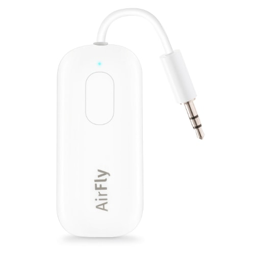
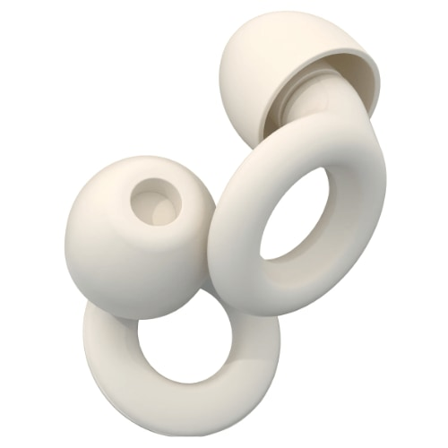
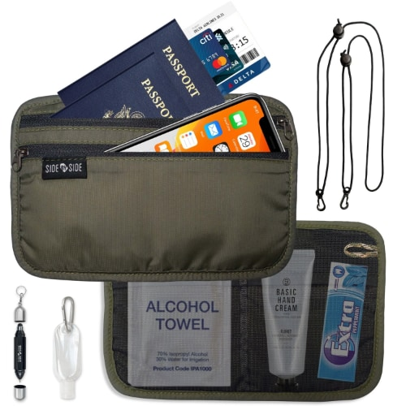
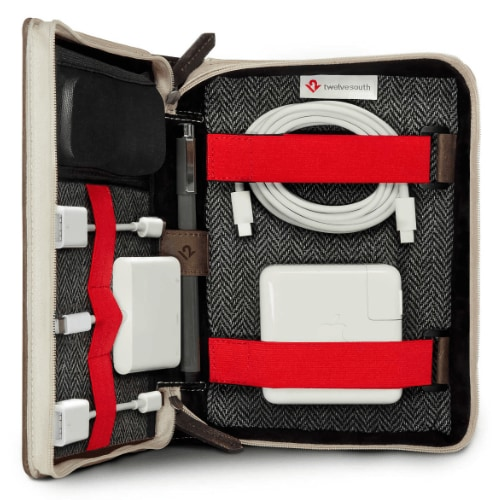
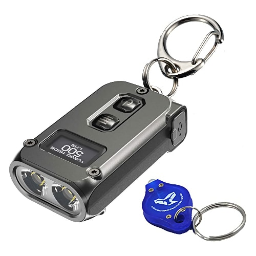
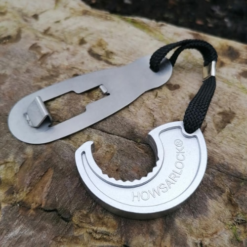

# Travel Products

**None of these are required**, but some of them will probably make your travel experience better. There are cheaper options, but these are high quality and are likely to last.

{== These are **NOT** sponsored product placements. ==} These are products that we can personally recommend. See our [ethics statement](../meta/ethics.md).

## Suggested products

* :fontawesome-solid-person-hiking:{ .lg .middle } **[Osprey Farpoint® 40 (Men’s)](https://www.osprey.com/us/en/product/farpoint-40-travel-pack-FARPONT40F22_550.html)**

    ---

    

    Big travel backpack. Can be used instead of a suitcase. Rugged.

* :fontawesome-solid-person-hiking:{ .lg .middle } **[Osprey Fairview® 40 (Women’s)](https://www.osprey.com/us/en/product/fairview-40-travel-pack-FAIRVEW40F22_550.html)**

    ---

    

    Big travel backpack. Can be used instead of a suitcase. Rugged.

* :fontawesome-solid-person-hiking:{ .lg .middle } **[Osprey Daylite® Plus](https://www.osprey.com/us/en/product/daylite-plus-DAYLTPLUSS21_778.html)**

    ---

    

    Light day pack. Great for walking around with a few things during the day.

* :material-headphones:{ .lg .middle } **[Twelve South Airfly Pro](https://www.twelvesouth.com/products/airfly)**

    ---

    

    Converts a 3.5mm headphone port to work with Bluetooth headphones.

* :material-earbuds:{ .lg .middle } **[Loop Quiet](https://us.loopearplugs.com/products/quiet)**

    ---

    

    Re-usable earplugs (**not** headphones). High quality. For traveling with snorers.

* :material-passport:{ .lg .middle } **[Side by Side RFID Passport Pouch](https://sidebysidegear.com/products/side-by-side-kit)**

    ---

    

    Holds your passport and other things in one place. Blocks RFID signals.

* :material-cable-data:{ .lg .middle } **[Side by Side Power Packer](https://sidebysidegear.com/products/the-power-packer)**

    ---

    

    Efficiently stores cables: USB, Lightning, HDMI, Magsafe, SD cards, etc.

* :material-cable-data:{ .lg .middle } **[Twelve South BookBook CaddySack](https://www.twelvesouth.com/products/bookbook-caddysack)**

    ---

    

    Similar to the _Side by Side Power Packer_. More expensive, but maybe a better shape.

* :material-bowl:{ .lg .middle } **[Tom Bihn Travel Tray](https://www.tombihn.com/collections/best-sellers/products/travel-tray)**

    ---

    

    Perfect for storing miscellaneous items that end up in your pockets.

* :material-flashlight:{ .lg .middle } **[Nitecore® TINI 2 Keychain Flashlight](https://www.amazon.com/dp/B08NLKCMKQ)**

    ---

    

    Great to have on-hand if you need a flashlight, but your phone battery is low.

* :material-lock:{ .lg .middle } **[Howsarlock® Metal Door Lock](https://howsarlock.com/product/howsarlock-metal/)**

    ---

    

    Locks a door from the inside. Great for hotels, motels, and hostels.

